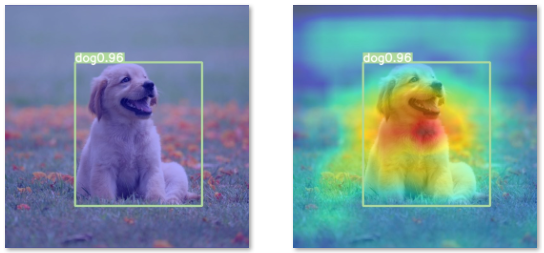

#  GradCAM on YOLOv7 — Visualizing What YOLO Learns

This project integrates **GradCAM (Gradient-weighted Class Activation Mapping)** with **YOLOv7** to better understand **which features** the model focuses on when making detection decisions.

---

##  Motivation

- YOLO series models are widely known for their excellent performance on object detection tasks.
- But do they really "understand" the objects they detect?
- This project visualizes YOLOv7's internal attention using GradCAM to **reveal which parts of the image influence detection results**.

---

##  Related Resources

- 📘 [My technical walkthrough on YOLO training and detection (iT 邦幫忙)](https://ithelp.ithome.com.tw/users/20120310/ironman/6372)
- 🧠 One-stage detectors: YOLO, SSD, RetinaNet
- 💬 [How to train YOLO models (step-by-step)](https://ithelp.ithome.com.tw/users/20120310/ironman/6372)

---

##  What is GradCAM?

**GradCAM (Gradient-weighted Class Activation Mapping)** is an Explainable AI (XAI) technique to:

- Visualize important regions that contribute to a model’s prediction.
- Provide interpretability and diagnostic power during training or production.

GradCAM works by:
- Extracting activations from intermediate layers.
- Weighting these activations using the average gradient with respect to the predicted class.
- Overlaying the heatmap onto the original image to highlight influential regions.

---

##  Code Modifications

To support GradCAM visualization, a few changes are needed in YOLOv7’s original codebase.

###  Modify Original YOLOv7 Files

- `./model/yolo.py`  
- `./model/experimental.py`

###  Add New Files

- `./model/gradcam.py` – Core GradCAM logic
- `./model/yolov7_object_detector.py` – YOLOv7 wrapper for GradCAM
- `main_gradcam.py` – Main script to run GradCAM visualizations

---

##  Results

Example output below shows the GradCAM visualization overlaying the detection result, helping interpret what the YOLOv7 model "sees".

---

##  TODO

- [ ] Add detailed code explanations and annotations
- [ ] Extend to other YOLO versions (e.g., v5, v8)
- [ ] Combine with other XAI tools (e.g., Score-CAM, LIME)

---

##  Acknowledgments

- YOLOv7 original repo: https://github.com/WongKinYiu/yolov7
- GradCAM reference: https://arxiv.org/abs/1610.02391
